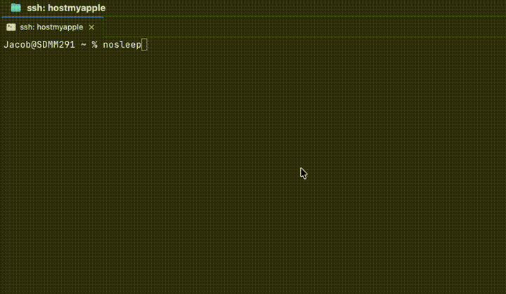

# nosleep

> Keep your Mac running with the lid closed — without walking through an airport holding it half open.

[](#)
[](#)
[](LICENSE)
[](#privacy--what-this-script-actually-does)

```bash
nosleep on     # disable sleep until you say otherwise
nosleep off    # re-enable
nosleep 2h     # disable for 2 hours, auto-re-enable
nosleep        # 30 minutes (the safe default — auto-recovers)
```



That's it. ~430 lines of bash, zero dependencies, no telemetry.

## Install

```bash
# Curl (works on any Mac, no dependencies):
curl -fsSL https://raw.githubusercontent.com/tmad4000/nosleep/main/install.sh | bash

# Or via Homebrew:
brew install tmad4000/nosleep/nosleep && nosleep --setup
```

Either path installs the binary to `/usr/local/bin/nosleep`, then runs `nosleep --setup` once to grant passwordless access to `pmset` (and only `pmset`). Fully reversible — `nosleep --uninstall` removes everything.

<details>
<summary>Manual install</summary>

```bash
curl -o /usr/local/bin/nosleep https://raw.githubusercontent.com/tmad4000/nosleep/main/nosleep.sh
chmod +x /usr/local/bin/nosleep
nosleep --setup
```
</details>

---

## Why this exists

On **May 13, 2026**, Business Insider ran a story called *"Good news, AI coders: You can keep your laptop running while closed"* about developers walking around with their MacBook lids cracked open so their AI agents wouldn't die mid-task. One quoted developer:

> "didn't know" about the tricks. "I think it's too much friction."

The friction is real — Apple's built-in `caffeinate` only prevents **idle** sleep. The moment you close the lid, your Mac sleeps anyway and your long-running coding agent, training job, download, or background task dies.

There's exactly one knob that actually works: `sudo pmset -a disablesleep 1`. But it prompts for a password every time, so nobody uses it. `nosleep` is that knob, wrapped to need a password exactly once (during setup), with a timed default that auto-recovers and a clean Ctrl+C trap.

That's the whole product.

---

## Usage

```bash
nosleep              # 30 minutes (safe default, auto-recovers)
nosleep 45m          # 45 minutes
nosleep 2h           # 2 hours
nosleep 1h30m        # 1.5 hours
nosleep 8h           # overnight job
nosleep 3600         # a bare number is still seconds
nosleep on           # indefinitely, until you run `nosleep off`
nosleep off          # re-enable sleep right now
nosleep status       # show current sleep state
nosleep --help       # full help
nosleep --version
```

Durations take `s`/`m`/`h` (and the spelled-out forms — `30min`, `2hours`, `90sec` all work), can be combined (`1h30m`), and a bare number still means seconds so old habits and scripts keep working.

Aliases for `on`/`off`/`status`: `--on`/`-on`/`-o`, `--off`/`-off`/`-O`, `--status`/`-s`. All work the same.

Timed mode prints its own escape hatches when it starts — other durations, how to stop early, and where the full help lives — so you never have to remember the flags to get out.

**Workflow for a long agent session:**

```bash
nosleep on
# ...close the lid, walk to the coffee shop, your agent keeps running...
nosleep off         # when you're done
```

**Workflow for a finite task:**

```bash
nosleep 2h          # 2 hours
# Ctrl+C any time to cleanly re-enable sleep
```

**The rescue lever:** if you ran `nosleep on` an hour ago and aren't sure whether you're still in indefinite mode, just run plain `nosleep`. It overrides indefinite mode and auto-recovers in 30 minutes, with a clear "overriding indefinite mode" message. Use it whenever you're not sure.

---

## How it works

`nosleep` is a bash wrapper around one Apple-supported command:

```bash
sudo pmset -a disablesleep 1   # disable sleep
sudo pmset -a disablesleep 0   # re-enable sleep
```

The `--setup` step writes a single sudoers rule at `/etc/sudoers.d/pmset`:

```
your_username ALL=(ALL) NOPASSWD: /usr/bin/pmset
```

That grants passwordless access to **only** `pmset` — not "all sudo," just the power-management binary Apple already ships. Everything else still needs your password.

The timed mode (`nosleep 2h`) installs a `trap` on `INT`, `TERM` and `HUP`, so Ctrl+C or closing the terminal cleanly re-enables sleep, and the countdown re-enables it when it expires.

**Known limits (be aware before leaving a Mac unattended):**

- `nosleep on` is indefinite by design. It exits immediately and leaves no process behind, so nothing will re-enable sleep until you run `nosleep off`.
- `pmset` settings are persistent system state, so **a reboot does not revoke them.** If the machine reboots while sleep is disabled, it comes back with sleep still disabled.
- A `kill -9`, kernel panic, or power loss during timed mode skips the trap entirely and strands `disablesleep 1`.

If you're unsure of the current state, `nosleep status` reads it live from `pmset`, and plain `nosleep` is the rescue lever — it auto-recovers in 30 minutes.

---

## Privacy — what this script actually does

**No telemetry, no analytics, no phone-home.** Every command except `nosleep update` is local-only — they only invoke `/usr/bin/pmset` on your Mac. Read [the source](nosleep.sh) — it's ~430 lines.

The single network call in the script is the opt-in `nosleep update` command, which fetches the installer from GitHub to upgrade your local binary. It only fires when you ask for it. No background checks, no version pings, no update banners.

## Updating

```bash
nosleep update          # If you installed via curl
brew upgrade nosleep    # If you installed via Homebrew
```

Both are idempotent — safe to run any time.

---

## Uninstall

```bash
nosleep --uninstall
```

Removes the binary at `/usr/local/bin/nosleep`, removes `/etc/sudoers.d/pmset`, and re-enables sleep. Or, if you installed via Homebrew:

```bash
brew uninstall nosleep
sudo rm /etc/sudoers.d/pmset    # if you ran --setup
```

---

## FAQ

**Q: Won't this drain my battery if I forget to turn it off?**
A: Yes — that's why timed mode exists. `nosleep 1h` auto-re-enables after an hour. The `--on` / `--off` mode is for sessions you actively manage.

**Q: Is this safe to run with the lid closed?**
A: Yes, that's the entire point. The Mac will continue running on battery (or AC if plugged in) until you call `--off` or the timer expires.

**Q: Does this work on Apple Silicon?**
A: Yes, M1/M2/M3/M4 all use the same `pmset` interface.

**Q: Why not just use [Amphetamine](https://apps.apple.com/us/app/amphetamine/id937984704)?**
A: Amphetamine is great if you want a GUI. `nosleep` is for people who live in the terminal — one command, scriptable, no app to install, no menu bar icon. Use whichever fits.

**Q: Does this prevent the screen from turning off too?**
A: Not by default — `disablesleep` affects system sleep, not display sleep. Add `--keep-display` (or `-kd`) to any command if you also want the screen to stay lit: `nosleep 2h --keep-display`. `nosleep off` restores your previous display-sleep timer.

**Q: What about clamshell mode with an external monitor?**
A: That already works on macOS by default when connected to power + external display + keyboard. `nosleep` is for the *no-external-monitor* case — i.e. you actually want your closed laptop to keep computing.

---

## Not on macOS?

| OS | Equivalent |
|---|---|
| **Linux (systemd)** | `systemd-inhibit --what=sleep --who=me --why="long task" sleep 3600` |
| **Linux (any)** | Disable suspend in your DE settings, or `xset s off; xset -dpms` |
| **Windows** | `powercfg /requestsoverride PROCESS yourapp.exe SYSTEM` or use [Don't Sleep](https://www.softwareok.com/?seite=Microsoft/DontSleep) |

This repo is macOS-only by design. The pattern is the same everywhere: find your OS's "disable suspend" knob, wrap it in something that auto-cleans up.

---

## Contributing

Issues and PRs welcome. Keep it small. The whole appeal of this tool is that you can read every line in 30 seconds.

If you ship a port for another OS, link it here and I'll add a row to the table.

---

## Credits

Originally part of [vibe-coding-guide](https://github.com/tmad4000/vibe-coding-guide), spun out as a standalone repo after the [May 13, 2026 Business Insider story](https://www.aol.com/articles/good-news-ai-coders-keep-091502000.html) made it clear a lot of people needed this.

Built by [@tmad4000](https://github.com/tmad4000). MIT licensed.
